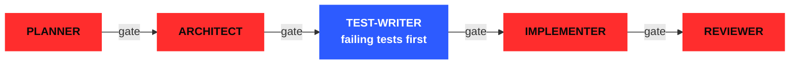

  Backend engineer with <b>5+ years</b> of production systems in HIPAA-regulated, high-availability environments. 
  Billing workflows, event-driven architectures, data migrations, background processing. 
  Lately: <b>AI pipelines that go beyond toy demos.</b>

  <b><a href="mailto:fernandonietop9@gmail.com">→ EMAIL</a></b> &nbsp;■&nbsp;
  <b><a href="https://linkedin.com/in/fernandonieto9">↗ LINKEDIN</a></b> &nbsp;■&nbsp;
  <b>● BARRANQUILLA, CO</b>

## `// 01` &nbsp; [MIRA ↗](https://github.com/mira-js) &nbsp;MARKET INTELLIGENCE FOR FOUNDERS AND PRODUCT TEAMS

> **Ask a question about a market. Get a report where every claim links back to its source.**

Ask *"what do people hate about X"* and Mira turns it into a research plan, pulls public discussion from **Reddit, Hacker News, Indie Hackers, RSS/news, Trustpilot and G2**, and runs an LLM pipeline over it. Out comes themes, pain points, competitor weaknesses, sentiment, an executive summary and recommended actions.

`INVITE-ONLY PRE-RELEASE` `AGPL-3.0 OPEN CORE` &nbsp;·&nbsp; `TypeScript` `Hono` `Svelte 5` `PostgreSQL` `Redis`

**The fun part is how it's built.** Every ticket runs through a multi-agent pipeline I designed, with a human approval gate between each stage:

Hooks block any commit that adds test failures. Test-tampering checks stop the implementer from editing the tests. ~20 ADRs, versioned prompts with an eval harness, and a run ledger that scores every agent's cost and cache-hit rate per ticket.

## `// 02` &nbsp; DEEPDIVER &nbsp;TRUE WINRATE CALCULATOR · <code>PRIVATE FOR NOW</code>

> **Pre-computed game analytics. Never computed on-request.**

Turborepo monorepo (API, crawler, analyzer, Riot API client, rate limiter). BullMQ batches every metric in the background; Redis serves every request.

## `// 03` &nbsp; TRACK RECORD

<table>
<tr>
<td align="center" width="33%"><h1>−76%</h1><b>DEPLOY TIME</b> 17 → 4 min via CI/CD</td>
<td align="center" width="33%"><h1>−17%</h1><b>INFRA COSTS</b> AWS ECS/EC2 right-sizing</td>
<td align="center" width="33%"><h1>$2M+</h1><b>B2B PARTNERSHIP</b> tech constraints → stakeholder language</td>
</tr>
</table>

**Gorilla Logic** · Healthcare (US) · `2024–2025` &nbsp;■&nbsp; **Rootstrap** · EdTech (US) · `2021–2023` &nbsp;■&nbsp; **Ayenda** · Hospitality · `2019–2021`

## `// 04` &nbsp; STACK

`Ruby on Rails` `TypeScript` `Node.js` `PostgreSQL` `Redis` `BullMQ` `AWS` `Docker` `Terraform`

<b>THE FULL ARSENAL ↓</b>

**Languages** Ruby · TypeScript · JavaScript · PHP
**Backend** Rails · Node.js · Deno · Laravel · REST · GraphQL
**AWS** EC2 · ECS · S3 · Lambda · SQS · SNS · EventBridge · Step Functions · DynamoDB · CloudWatch
**Data** PostgreSQL · MongoDB · Redis · Sidekiq · BullMQ · transactional migrations · caching
**AI** multi-source LLM pipelines · semantic embeddings · multi-agent orchestration · model routing · MCP servers
**DevOps** Docker · Terraform · Semaphore · CircleCI · Jenkins
**Testing** RSpec · Capybara · Jest · Testing Library · TDD/BDD

TECHNICAL DEGREE IN COMPUTER SCIENCE, SENA (2018) &nbsp;■&nbsp; HIPAA COMPLIANCE TRAINING

